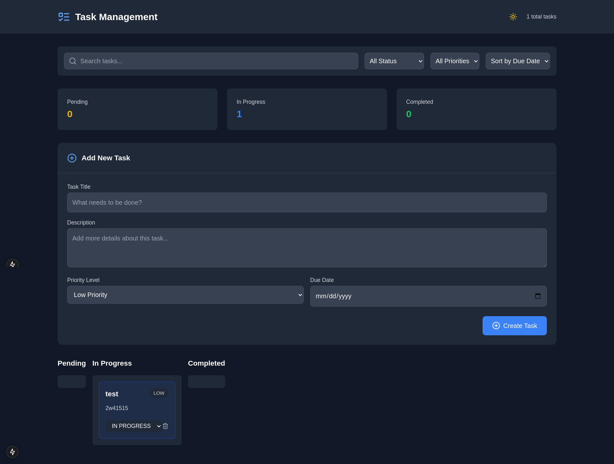

# Task Management System with Kanban Board

A modern task management system built with Next.js 13, featuring a drag-and-drop Kanban board interface, dark mode, and real-time status updates.



## Features

- 📋 Drag-and-drop Kanban board
- 🌓 Dark/Light mode toggle
- 🔍 Search and filter tasks
- 🏷️ Priority levels (Low, Medium, High)
- 📅 Due date tracking
- 🔄 Real-time status updates
- 📱 Responsive design
- 🎯 Task categorization
- ⚡ Server-side rendering
- 🔄 Optimistic updates

## Tech Stack

- **Framework**: Next.js 13 (App Router)
- **Database**: PostgreSQL
- **ORM**: Prisma
- **Styling**: Tailwind CSS
- **State Management**: React Hooks
- **Drag and Drop**: dnd-kit
- **Icons**: Lucide React
- **Date Handling**: date-fns
- **Notifications**: react-toastify

## Getting Started

### Prerequisites

- Node.js 16.8 or later
- PostgreSQL database
- npm or yarn

## Project Structure

```
task-management/
├── prisma/
│   ├── schema.prisma
│   └── migrations/
├── src/
│   ├── app/
│   │   ├── api/
│   │   │   └── tasks/
│   │   │       └── route.ts
│   │   ├── page.tsx
│   │   └── layout.tsx
│   ├── components/
│   │   └── ui/
│   └── lib/
│       └── prisma.ts
├── public/
└── package.json
```

## Database Schema

```prisma
model Task {
  id          String   @id @default(cuid())
  title       String
  description String?
  status      Status   @default(PENDING)
  priority    Priority @default(MEDIUM)
  dueDate     DateTime?
  createdAt   DateTime @default(now())
  updatedAt   DateTime @updatedAt
}

enum Status {
  PENDING
  IN_PROGRESS
  COMPLETED
}

enum Priority {
  LOW
  MEDIUM
  HIGH
}
```

## API Routes

- `GET /api/tasks` - Fetch all tasks
- `POST /api/tasks` - Create new task
- `PATCH /api/tasks` - Update task status
- `DELETE /api/tasks` - Delete task

## Key Features Implementation

### Drag and Drop
The Kanban board uses `@dnd-kit/core` and `@dnd-kit/sortable` for smooth drag-and-drop functionality between columns:

```typescript
<DndContext
  sensors={sensors}
  collisionDetection={closestCorners}
  onDragStart={handleDragStart}
  onDragEnd={handleDragEnd}
>
  {/* Columns and Tasks */}
</DndContext>
```

### Dark Mode
Implemented using React state and Tailwind CSS classes:

```typescript
const [darkMode, setDarkMode] = useState(false);
// Usage in className
`${darkMode ? 'bg-gray-900' : 'bg-gray-50'}`
```

### Task Filtering
Real-time filtering based on search terms and priority:

```typescript
const filteredTasks = tasks.filter(task => 
  task.title.toLowerCase().includes(searchTerm.toLowerCase()) &&
  (priorityFilter === 'ALL' || task.priority === priorityFilter)
);
```

